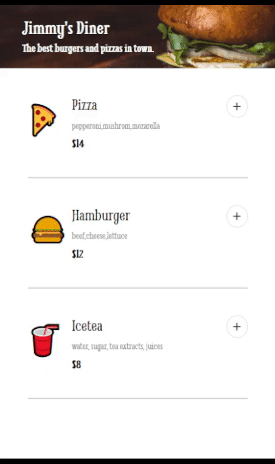

# Restaurant Ordering App
<b>Using this app, you can order your preferred meals.</b>

)

## Strech Goals
There are some strech goals for improvement for this project:
1. Offer a "meal deal" discount :white_large_square: * <!-- when checkhed :white_check_mark: --> 
2. Allow users to rate their experiences :white_large_square:

*Checkboxes will be checked once a task has been completed.

-------
This project was a solo project that I accomplished by myself. The design idea was given by <a href="https://scrimba.com/">Scrimba</a> from a course project in the Frontend Developer Career Path.
